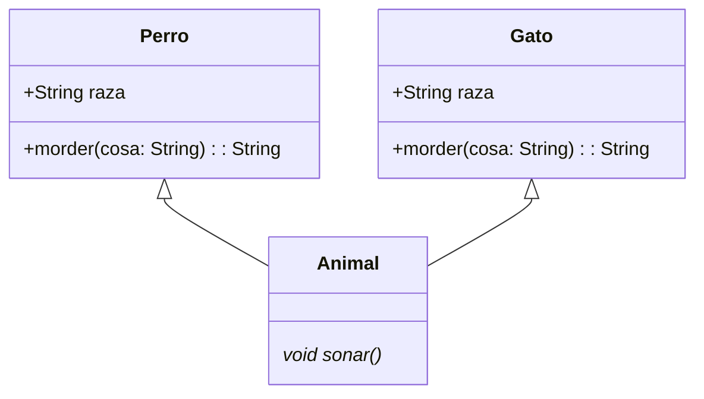
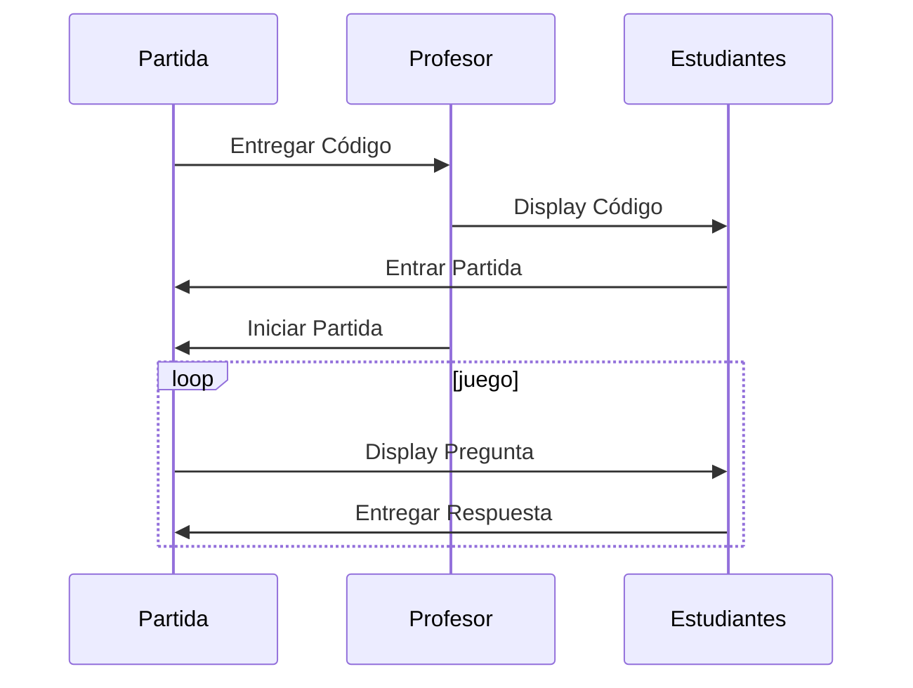
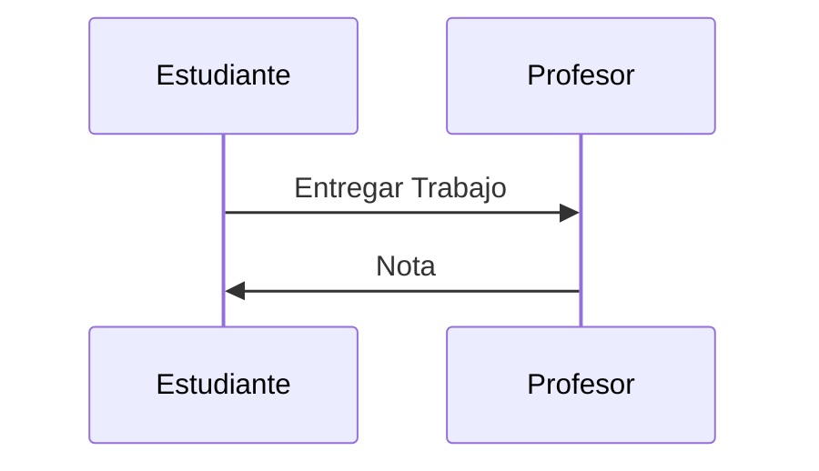
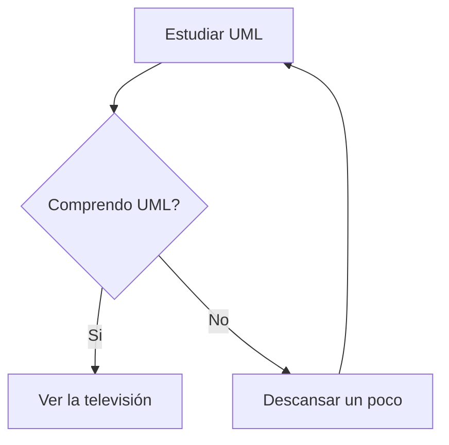
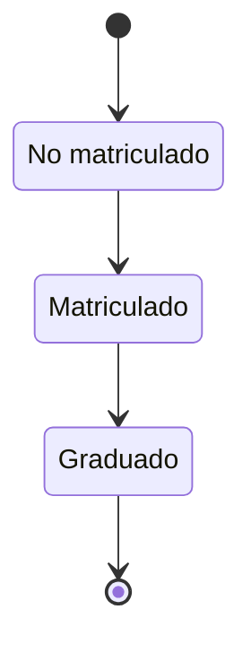

# DIAGRAMAS DE CLASES

## ANIMALES

EL SIGUIENTE DIAGRAMA REPRESENTA LA ESTRUCTURA DE CLASES DE LOS TIPOS DE ANIMALES DE LA APLICACIÓN

```java
class Perro extends Animal{
  String raza;
  
  String morder (String cosa) {
    return null;
  }
}

class Gato extends Animal{
  String raza;
  
  String morder (String cosa) {
    return null;
  }
}

abstract class Animal{
  void alimentar() {
  }
  abstract void sonar();
}
```



# DIAGRAMA DE SECUENCIA



# DIAGRAMA DE SECUENCIA



# DIAGRAMA DE ACTIVIDADES



# DIAGRAMA DE ESTADOS



