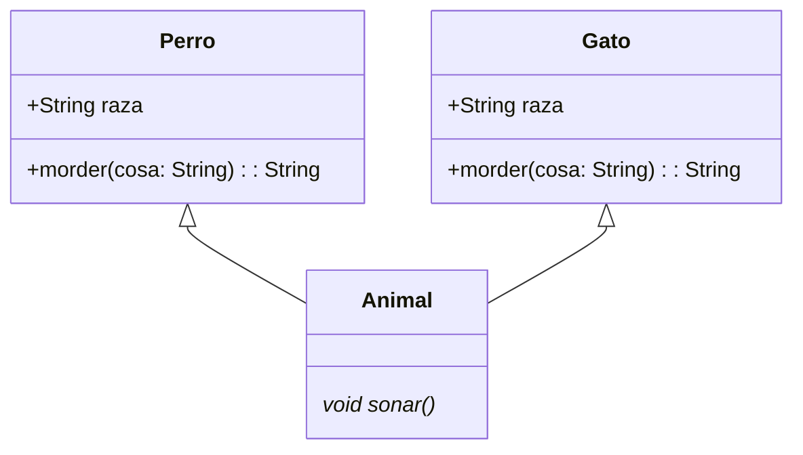

# DIAGRAMAS DE CLASES

## ANIMALES

EL SIGUIENTE DIAGRAMA REPRESENTA LA ESTRUCTURA DE CLASES DE LOS TIPOS DE ANIMALES DE LA APLICACIÓN

```java
class Perro extends Animal{
  String raza;
  
  String morder (String cosa) {
    return null;
  }
}

class Gato extends Animal{
  String raza;
  
  String morder (String cosa) {
    return null;
  }
}

abstract class Animal{
  void alimentar() {
  }
  abstract void sonar();
}
```



```sequenceDiagram
  Estudiante ->> Profesor: Síncrono
  Estudiante -->> Profesor: Síncrono (respuesta)
  Estudiante -) Profesor: Asíncrono
```
```stl
solid cube_corner
  facet normal 0.0 -1.0 0.0
    outer loop
      vertex 0.0 0.0 0.0
      vertex 1.0 0.0 0.0
      vertex 0.0 0.0 1.0
    endloop
  endfacet
  facet normal 0.0 0.0 -1.0
    outer loop
      vertex 0.0 0.0 0.0
      vertex 0.0 1.0 0.0
      vertex 1.0 0.0 0.0
    endloop
  endfacet
  facet normal -1.0 0.0 0.0
    outer loop
      vertex 0.0 0.0 0.0
      vertex 0.0 0.0 1.0
      vertex 0.0 1.0 0.0
    endloop
  endfacet
  facet normal 0.577 0.577 0.577
    outer loop
      vertex 1.0 0.0 0.0
      vertex 0.0 1.0 0.0
      vertex 0.0 0.0 1.0
    endloop
  endfacet
endsolid
```
